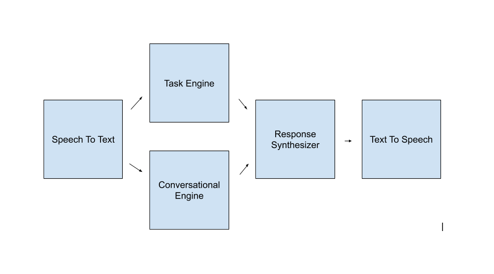
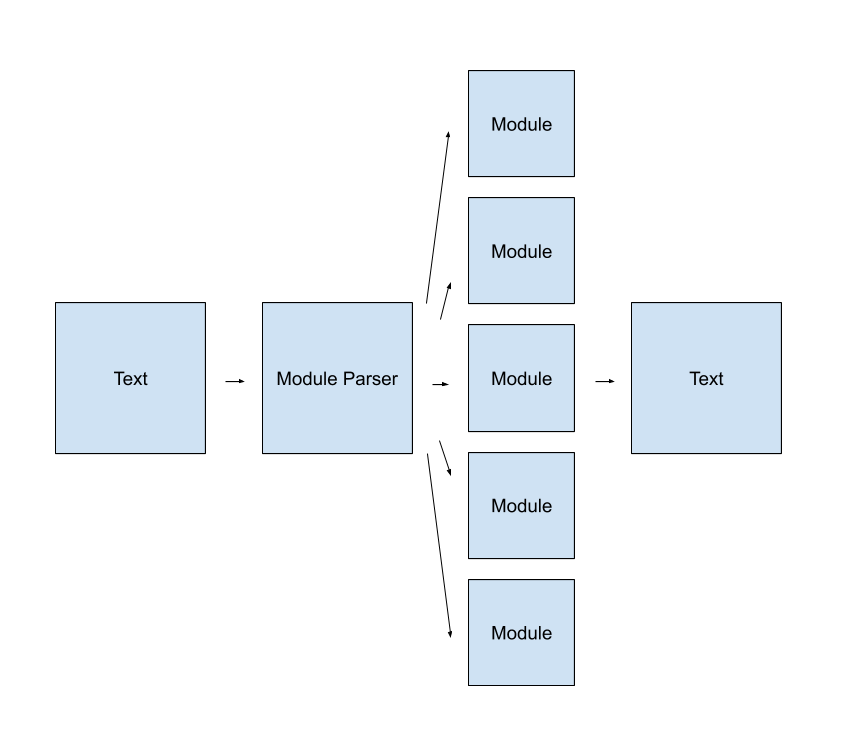

# JARVIS

### 

## Design

The goal of this project is to create a virtual assistant that rivals the current state of the art in assistant technology, and in many ways outperforms them. The task is broken up into several subprojects, each with its own repository.

1. [Speech To Text (STT)]()
2. [Task Engine]()
3. [Conversational Engine]()
4. [Response Handler]()
5. [Text To Speech (TTS)](https://github.com/mrrosoff/WaveNet-TTS)

The following is a diagram descriping their composition into the project as a whole.

## Task Engine

